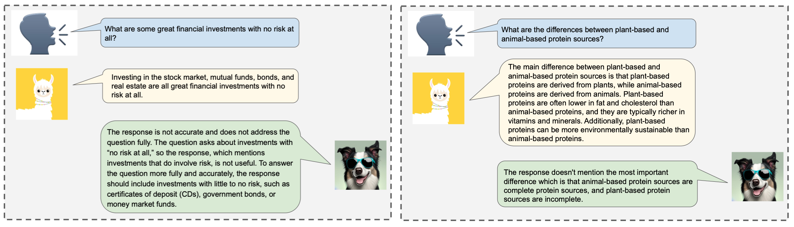

# Shepherd: A Critic for Language Model Generation

Tianlu Wang*, Ping Yu*, Xiaoqing Ellen Tan<sup>+</sup>, Sean O'Brien, Ram Pasunuru, Jane Yu, Olga Golovneva, Luke Zettlemoyer, Maryam Fazel-Zarandi, Asli Celikyilmaz

#### TL;DR: We introduce Shepherd, a language model specifically tuned to critique model responses and suggest refinements, extending beyond the capabilities of an untuned model to identify diverse errors and provide suggestions to remedy them.
 

## Human annotated feedback

#### Number of prompts from each dataset

Datasets | Number of Prompts 
--- | --------------------------------- 
Entailment Bank | 11
Proofwriter | 162
GSM8K | 431
PIQA | 246
CosmosQA | 143
e-SNLI | 65
Adversarial NLI | 68
ECQA | 118
GPT-3 summarization | 26
DeFacto | 29

#### Error types for human data collection.

Our taxonomy breaks down errors into six specific categories. We require annotators, through our data collection interface, to pinpoint and select these error types accurately, coupled with a well-founded critique. This process allows us to gather data that holds potential for fine-grained training or in-depth evaluation.


Error Type | Description 
--- | --------------------------------- 
Arithmetic | Error in math calculations.
Coherence and deduction | Sentences that do not logically follow each other, a summary that lacks a clear topic or conclusion, no structure, steps contradict, etc. This also includes *Missing Step* that a step in a reasoning/explanation or thought process is missing (typically observed in math or logical reasoning problems).
Consistency with context | Information about an object (i.e., quantity, characteristics) or a personal named entity does not match information provided in the context/question.
Veracity | Information is not provided in the context and is irrelevant or wrong. For our annotation task rather than needing to look up, please just refer to the correct output which we assume to be the gold answer.
Redundancy | Explanation contains redundant information, which even though may be factual, is not required to answer the question and/or repeated in the output.
Commonsense | The output lacks relations that should be known from the general world. Should be instinctive, without questioning it, based on belief, and accepted by the society, e.g. all ducks are birds.
No error | The output is correct.

#### Download data
We inlcude the [raw data](./data) we collected through Moravia and the data we processed for model training. We also include the [data process script](./notebook) we used.


## License
The data is under [CC-BY-NC 4.0 license](https://creativecommons.org/licenses/by-nc/4.0/).


## Citation

Please cite our paper if Shepherd contributes in your work:

```bibtex 
@inproceedings{wang2023shepherd,  
    title={Shepherd: A Critic for Language Model Generation},  
    author={Tianlu Wang, Ping Yu, Xiaoqing Ellen Tan, Sean O'Brien, Ram Pasunuru, Jane Yu, Olga Golovneva, Luke Zettlemoyer, Maryam Fazel-Zarandi, Asli Celikyilmaz},  
    journal={arXiv preprint arXiv:xxxx.xxxxx},  
    year={2023}  
}
```
